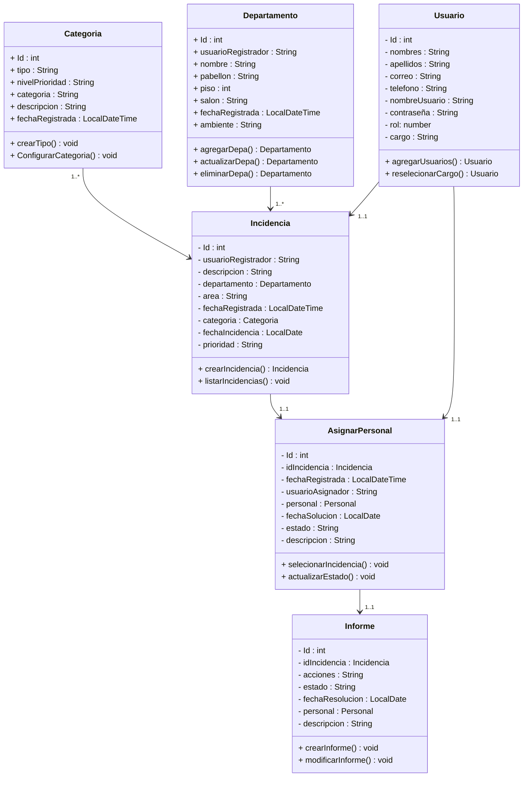

```mermaid
classDiagram
    class Incidencia {
        - Id : int
        - usuarioRegistrador : String
        - descripcion : String
        - departamento : Departamento
        - area : String
        - fechaRegistrada : LocalDateTime
        - categoria : Categoria
        - fechaIncidencia : LocalDate
        - prioridad : String
        + crearIncidencia() Incidencia
        + listarIncidencias() void
    }

    class Usuario{
        - Id : int
        - nombres : String
        - apellidos : String
        - correo : String
        - telefono : String
        - nombreUsuario : String
        - contraseña : String
        - rol: number
        - cargo : String
        + agregarUsuarios () Usuario
        + reselecionarCargo() Usuario
    }

    class Departamento{
        + Id : int
        + usuarioRegistrador : String
        + nombre : String
        + pabellon : String
        + piso : int
        + salon : String
        + fechaRegistrada : LocalDateTime
        + ambiente : String
        + agregarDepa() Departamento
        + actualizarDepa() Departamento
        + eliminarDepa() Departamento
    }

    class Categoria {
        + Id : int
        + tipo : String
        + nivelPrioridad : String
        + categoria : String
        + descripcion : String
        + fechaRegistrada : LocalDateTime
        + crearTipo() void
        + ConfigurarCategoria() void
    }

    class AsignarPersonal {
        - Id : int
        - idIncidencia : Incidencia
        - fechaRegistrada : LocalDateTime
        - usuarioAsignador : String
        - personal : Personal
        - fechaSolucion : LocalDate
        - estado : String
        - descripcion : String
        + selecionarIncidencia() void
        + actualizarEstado() void
    }

    class Informe{
        - Id : int
        - idIncidencia : Incidencia
        - acciones : String
        - estado : String
        - fechaResolucion : LocalDate
        - personal : Personal
        - descripcion : String
        + crearInforme() void
        + modificarInforme() void
    }

    Categoria "1..*" -->  Incidencia
    Departamento --> "1..*" Incidencia
    Usuario --> "1..1" Incidencia
    Incidencia --> "1..1" AsignarPersonal
    AsignarPersonal --> "1..1" Informe
    Usuario --> "1..1" AsignarPersonal

```