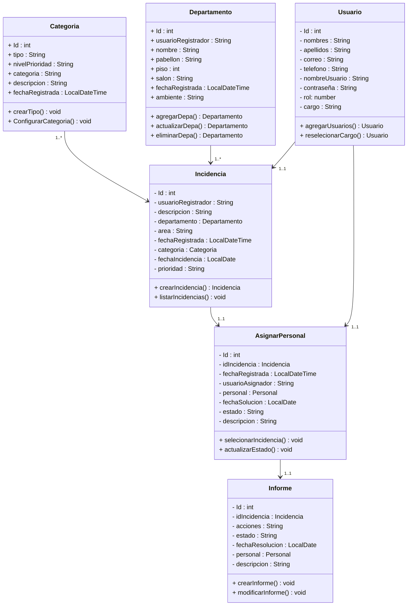

# APP WEB PARA EL MANEJO DE INCIDENCIAS INFORMÁTICAS EN LA UNIVERSIDAD CÉSAR VALLEJO LIMA NORTE 

---

Este proyecto tiene como objetivo desarrollar una aplicación web para el mantenimiento de los incidencias informaticas, hacer un seguimito de estas para luego dar un informe de como se pudo atender la incidencia.

## 🛠️ Características del Proyecto

- :computer: *Backend y Frontend estan mismo repositorio*  
  Proyecto integral con backend en Spring Boot (Java) y frontend en React.

- :gear: *Arquitectura RESTful con Spring Boot*  
  Uso de controladores, servicios y repositorios para una estructura limpia y escalable.

- :floppy_disk: *Base de datos relacional*  
  Gestión de usuarios, incidencias y su historial mediante MySQL.

- :lock: *Sistema de autenticación*  
  Inicio de sesión para estudiantes utilizando email y contraseña.

- :bug: *Gestión de incidencias informáticas*  
  Registro de incidencias por parte de los usuarios.  
  Asignación de técnicos responsables.  
  Cambios de estado: En espera, En trámite, Finalizado.

- :technologist: *Gestión de personal técnico*  
  Control y asignación de técnicos del área de soporte y sistemas.

- :chart_with_upwards_trend: *Seguimiento de estado y trazabilidad*  
  Historial completo de atención por incidencia.  
  Visualización de avances en tiempo real.

- :package: *Estructura modular y mantenible*  
  Separación por capas: Modelo, Repositorio, Servicio, Controlador (backend).  
  Organización clara de carpetas para el frontend en React.

## :gear: Requisitos del sistema

Para poder ejecutar los proyectos, se necesitan los siguientes requisitos:
- :wrench: Backend:
    - Java JDK 24 o modificar el [pom.xml](https://github.com/Renzito0637d/Proyect_Integrator_1/blob/main/ucvBackend/pom.xml#L30 "Aqui podras ver en donde modificar la version de tu JAVA") segun tus necesidades
    - Maven 3.8+
    - Base de datos MySQL 8+
    - Spring Boot 3.x
    - Postman (opcional, para pruebas de API)
    - IDE recomendadas:
        - IntelliJ IDEA
        - Spring Tools Suite
- :globe_with_meridians: Frontend:
    - Node.js 18+
    - npm o yarn
    - Framework React 18+
    - Editor recomendado:
        - Visual Studio Code
- :computer: Entorno de Desarrollo:
    - Sistema operativo:
        - Windows 10/11
        - Linux
        - macOS
    - Navegadores web modernos:
        - Chrome
        - Firefox
        - Edge

> [!NOTE] 
> ## :inbox_tray: Instalación
>Para ejecutar el proyecto localmente, sigue los siguientes pasos:
>1. Clona este repositorio:
>     ~~~bash
>     git clone https://github.com/Renzito0637d/Proyect_Integrator_1.git
>     ~~~
>2. Abre el proyecto en tu entorno de desarrollo.
> 
>      
> 
> 
>   3. Compila y ejecuta los proyectos.
>   
>       **Backend**:
>       ~~~bash
>       cd Proyect_Integrator_1\ucvBackend
>       mvn clean install
>       mvn spring-boot:run         
>       ~~~
>
>       **Frontend**:
>       ~~~bash
>       cd Proyect_Integrator_1\ucvfrontend
>       npm install
>       npm start         
>       ~~~
>
>       **Base de datos**:
>
>       Ejecutar el [script](https://github.com/Renzito0637d/Proyect_Integrator_1/blob/main/script_db.sql "Script de la base de datos")  en MySQL Workbench, **en caso de no haber conexión  con la base de datos configurar [app properties](https://github.com/Renzito0637d/Proyect_Integrator_1/blob/main/ucvBackend/src/main/resources/application.properties "En este archivo del proyecto podrás configurar la conexión de la base de datos MySQL") debes de configurar la _url_, _username_ y _password_ de la DB**.
>       ~~~bash
>       create DATABASE ucvincidencia;
>       use ucvincidencia;         
>       ~~~

## :clipboard: Requirimientos Funcionales (RF)
| ID  | Descripción                                                                                              | Estado            |
|-----|----------------------------------------------------------------------------------------------------------|-------------------|
| RF1 | El aplicativo permite el acceso a los recursos mediante un login                                         | ✔️      |
| RF2 | El aplicativo debe permitir la navegabilidad de los formularios mediante un menú                         | :heavy_check_mark:   |
| RF3 | El aplicativo permite el registro de tipos de incidencias informáticas y realizar el mantenimiento correspondiente | :heavy_check_mark: |
| RF4 | El aplicativo permite el registro de los empleados de la empresa y realizar el mantenimiento correspondiente | :heavy_check_mark: |
| RF5 | El aplicativo permite el registro de áreas y realizar el mantenimiento correspondiente                   | :heavy_check_mark:     |
| RF6 | El aplicativo permite el registro de una incidencia informática y realizar el mantenimiento correspondiente | :hourglass_flowing_sand:     |
| RF7 | El aplicativo permite asignar a un personal para la solución de la incidencia informática                 | :hourglass_flowing_sand:   |
| RF8 | El aplicativo permite al empleado registrar los detalles de la solución y observaciones de la incidencia solucionada | :hourglass_flowing_sand:|
| RF9 | El aplicativo permite realizar el seguimiento de la incidencia visualizando su estado: En proceso, Atendido, Derivado | :hourglass_flowing_sand:        |
| RF10| El aplicativo permite visualizar la lista de incidencias por rango de fechas                             | :hourglass_flowing_sand:         |

*Leyenda:*
- :heavy_check_mark: Completado
- :arrows_counterclockwise: En desarrollo
- :hourglass_flowing_sand: En espera
## :mag_right: Tecnologías Usadas

- *Backend*:
    - Spring Boot
    - Maven
        - *Dependencias*: 
            - Spring security
            - Spring web
            - MySQL Driver
            - Lombok
            - All Jwt
- *Frontend*:
    - React
    - Bootstrap
        - *Dependencias*:
            - axios
            - react-dom
            - react-scripts
            - web-vitals

- *Base de datos*:
    - MySQL

## Diagrama de clases

