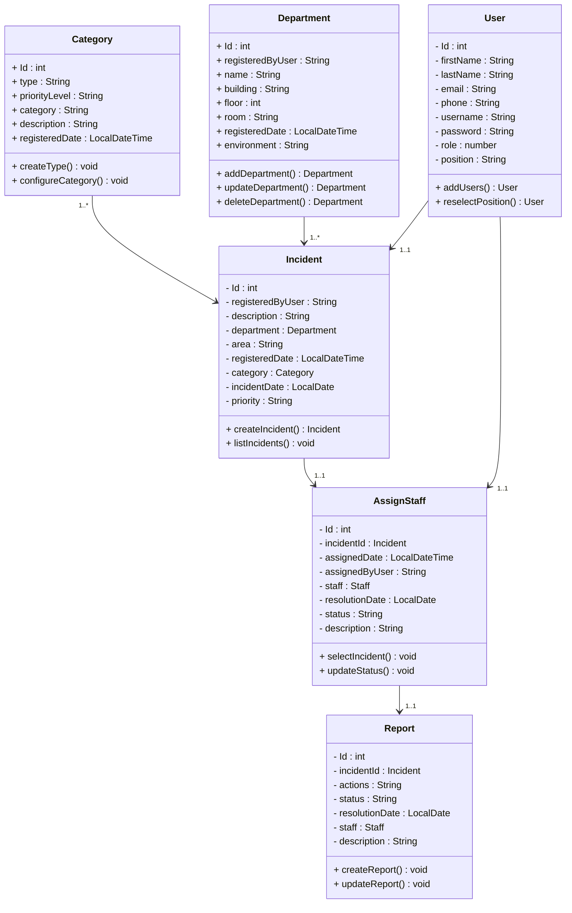

# WEB APP FOR MANAGING IT INCIDENTS AT CÉSAR VALLEJO UNIVERSITY LIMA NORTE 
           
---

This project aims to develop a web application for managing IT incidents, tracking them, and providing reports on how each was resolved.

## 🛠️ Project Features

- :computer: *Backend and Frontend in the same repository*  
  Full-stack project with Spring Boot (Java) backend and React frontend.

- :gear: *RESTful Architecture with Spring Boot*  
  Use of controllers, services, and repositories for a clean and scalable structure.

- :floppy_disk: *Relational database*  
  User, incident, and history management using MySQL.

- :lock: *Authentication system*  
  Login functionality for students using email and password.

- :bug: *IT incident management*  
  Users can report incidents.  
  Responsible technicians can be assigned.  
  Status transitions: Pending, In Progress, Resolved.

- :technologist: *Technical staff management*  
  Manage and assign support and system area technicians.

- :chart_with_upwards_trend: *Status tracking and traceability*  
  Full incident history.  
  Real-time progress visualization.

- :package: *Modular and maintainable structure*  
  Layered backend: Model, Repository, Service, Controller.  
  Clearly organized folder structure for the React frontend.

## :gear: System Requirements

To run the project, you need the following:

- :wrench: Backend:
    - Java JDK 24 or modify the [pom.xml](https://github.com/Renzito0637d/Proyect_Integrator_1/blob/main/ucvBackend/pom.xml#L30 "Modify the Java version here") to suit your version
    - Maven 3.8+
    - MySQL Database 8+
    - Spring Boot 3.x
    - Postman (optional, for API testing)
    - Recommended IDEs:
        - IntelliJ IDEA
        - Spring Tools Suite
- :globe_with_meridians: Frontend:
    - Node.js 18+
    - npm or yarn
    - React 18+ Framework
    - Recommended editor:
        - Visual Studio Code
- :computer: Development Environment:
    - Operating System:
        - Windows 10/11
        - Linux
        - macOS
    - Modern web browsers:
        - Chrome
        - Firefox
        - Edge

> [!NOTE]  
> ## :inbox_tray: Installation  
> To run the project locally, follow these steps:  
> 1. Clone this repository:
>     ~~~bash
>     git clone https://github.com/Renzito0637d/Proyect_Integrator_1.git
>     ~~~
> 2. Open the project in your development environment.
>
>       
>     
>
> 3. Build and run the projects.
>
>     **Backend**:
>     ~~~bash
>     cd Proyect_Integrator_1\ucvBackend
>     mvn clean install
>     mvn spring-boot:run         
>     ~~~
>
>     **Frontend**:
>     ~~~bash
>     cd Proyect_Integrator_1\ucvfrontend
>     npm install
>     npm start         
>     ~~~

## :clipboard: Functional Requirements (FR)

| ID  | Description                                                                                          | Status            |
|-----|------------------------------------------------------------------------------------------------------|-------------------|
| FR1 | The app allows access to resources through a login                                                   | ✔️                |
| FR2 | The app should allow navigation between forms via a menu                                             | :hourglass_flowing_sand: |
| FR3 | The app allows registration of IT incident types and their corresponding management                  | :hourglass_flowing_sand: |
| FR4 | The app allows registration of employees and their corresponding management                          | :hourglass_flowing_sand: |
| FR5 | The app allows registration of departments and their corresponding management                        | :hourglass_flowing_sand: |
| FR6 | The app allows registration of IT incidents and their corresponding management                       | :hourglass_flowing_sand: |
| FR7 | The app allows assigning a staff member to resolve an IT incident                                    | :hourglass_flowing_sand: |
| FR8 | The app allows employees to register solution details and observations on resolved incidents         | :hourglass_flowing_sand: |
| FR9 | The app allows tracking the status of an incident: In Progress, Resolved, Referred                   | :hourglass_flowing_sand: |
| FR10| The app allows viewing the list of incidents filtered by date range                                  | :hourglass_flowing_sand: |

*Legend:*
- :heavy_check_mark: Completed  
- :arrows_counterclockwise: In development  
- :hourglass_flowing_sand: Pending  

## :mag_right: Technologies Used

- *Backend*:
    - Spring Boot
    - Maven  
        - *Dependencies*:
            - Spring Security
            - Spring Web
            - MySQL Driver
            - Lombok
            - All Jwt
- *Frontend*:
    - React
    - Bootstrap  
        - *Dependencies*:
            - axios
            - react-dom
            - react-scripts
            - web-vitals

- *Database*:
    - MySQL

## Class Diagram

